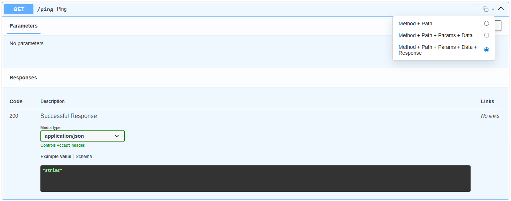
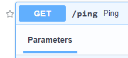
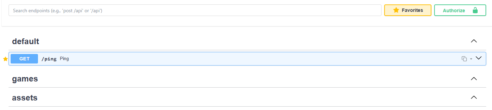
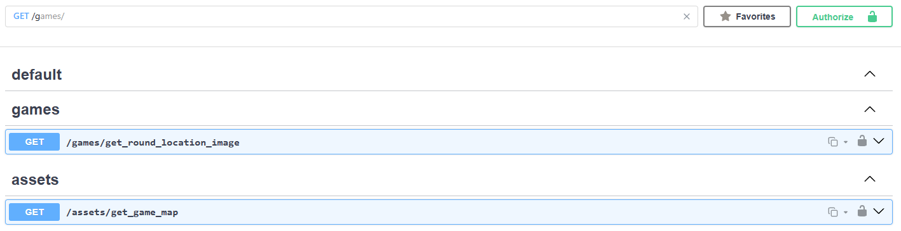
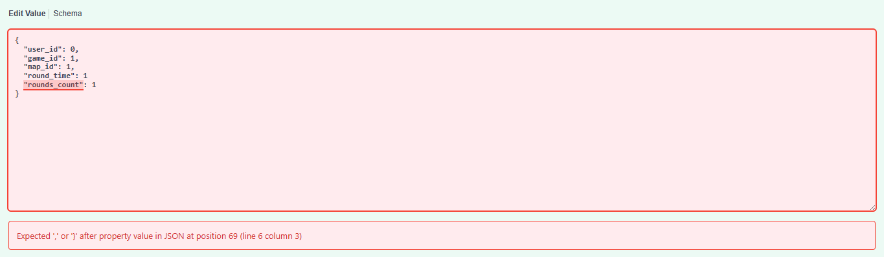
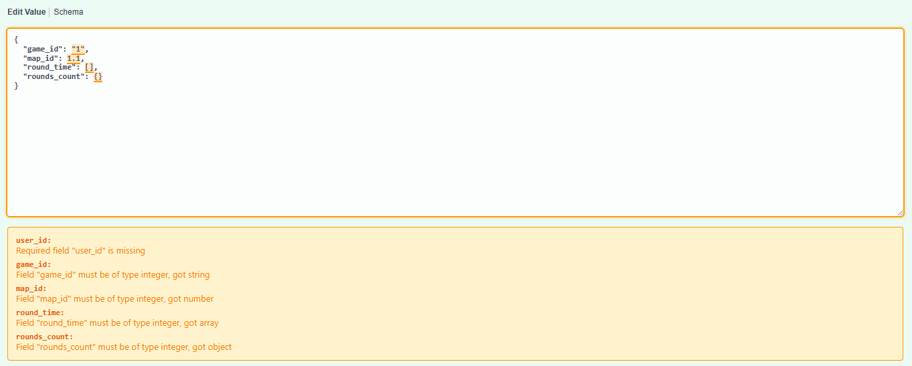

# Petodo Swagger Plugins

[](https://raw.githubusercontent.com/petodo-io/petodo-swagger-plugin/main/dist/petodo-swagger.user.js)

**Installation:** [Download userscript](https://raw.githubusercontent.com/petodo-io/petodo-swagger-plugin/main/dist/petodo-swagger.user.js)

To install:

1. Copy the URL above
2. Open Tampermonkey dashboard
3. Go to Utilities → Install from URL
4. Paste the URL and click Install

**Endpoint Copy Button**

Modes:

- method-path
- method-path-params-data
- method-path-params-data-response



**Favorites:** Mark popular endpoints with a star and display only favorites with a filter.





**Search:** Filter by method type and path.



**JSON Validation:** Highlights JSON errors in the request body. Highlights and annotates type errors in JSON body fields.





Other improvements:

- Schemas block is collapsed by default on first page load.
- Remembers expanded/collapsed state of Swagger sections.

For development:

```bash
npm install
```

```bash
npm run dev
```
